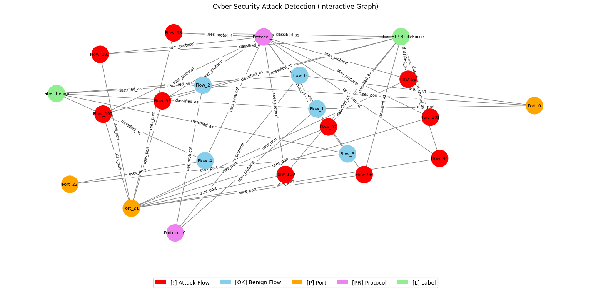

# 🔐 Graph-Based Cybersecurity Attack Detection

## 📌 Project Overview
This project detects cyber attacks using graph-based techniques on the CICIDS 2018 dataset.  
Network traffic is converted into a graph structure, and attack patterns are identified using the VF2 subgraph matching algorithm.

---

## 🚀 Features
- Graph modeling using NetworkX  
- Attack detection using dataset labels  
- VF2 subgraph matching algorithm  
- Interactive visualization (click nodes to view details)  
- Color-based attack highlighting  

---

## 🧠 Technologies Used
- Python  
- NetworkX  
- Matplotlib  
- Pandas  

---

## 📊 Dataset
CICIDS 2018 dataset is used for cybersecurity analysis.

---

## 🎯 Output
- 🔴 Red → Attack Flow  
- 🔵 Blue → Benign Flow  
- 🟠 Orange → Port  
- 🟣 Violet → Protocol  
- 🟢 Green → Label  

---

## 🖼️ Visualization
The system generates an interactive graph where:
- Attack flows are highlighted  
- Nodes can be clicked to view detailed information  
- Relationships between flows, ports, and protocols are visualized  



---

## 🧠 Methodology
1. Load CICIDS dataset  
2. Preprocess data (feature selection & cleaning)  
3. Convert data into graph structure using NetworkX  
4. Detect attacks using labels  
5. Apply VF2 subgraph matching for pattern detection  
6. Visualize results with interactive graph  

---

## 📊 Results
- Total Nodes: 5000+  
- Total Edges: 15000+  
- Attack patterns successfully detected  
- VF2 algorithm identifies FTP-BruteForce patterns  

---

## ▶️ How to Run

```bash
pip install -r requirements.txt
python src/main.py

## 🌐 Streamlit Dashboard

Run the interactive dashboard:

```bash
streamlit run src/app.py
